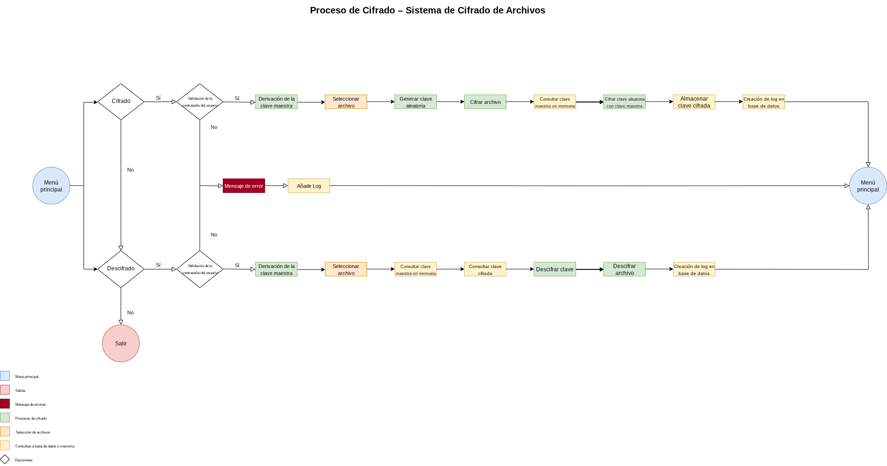
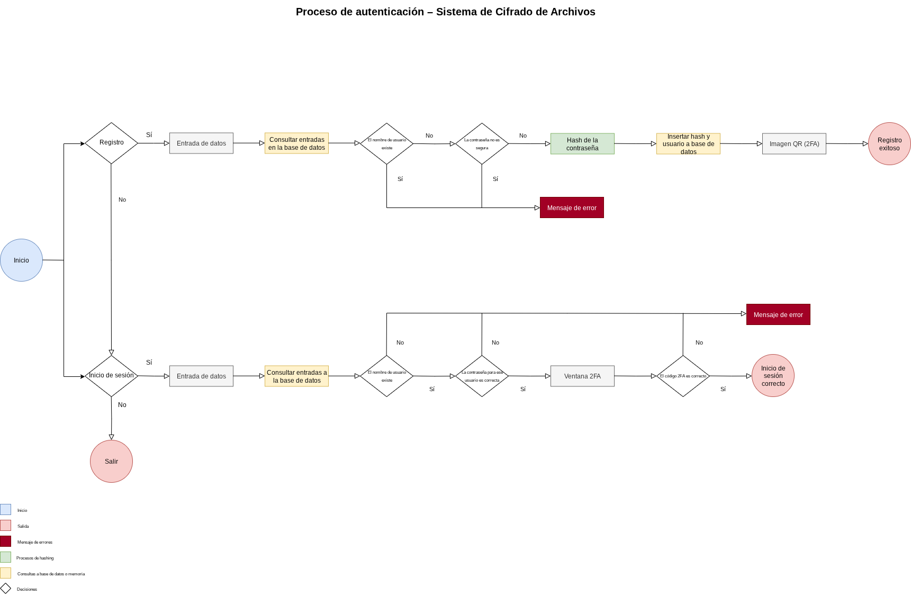
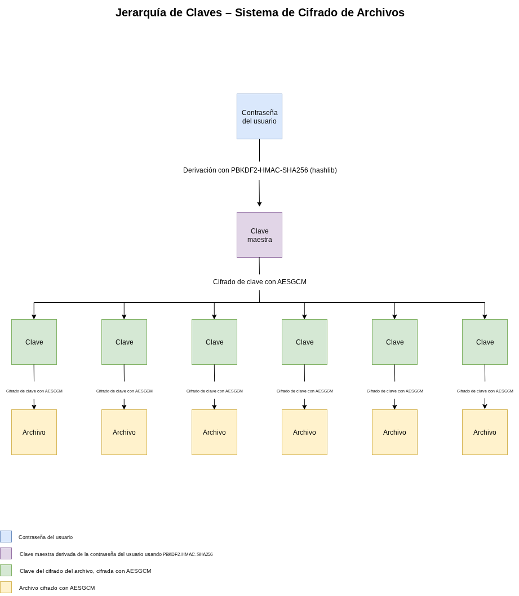
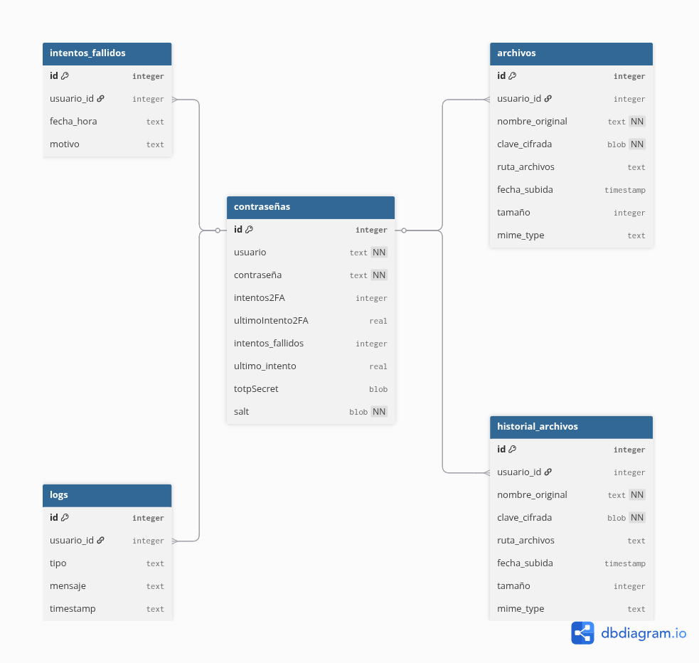
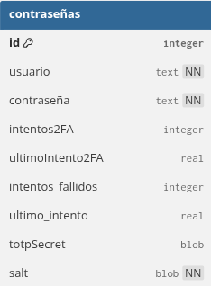
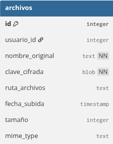
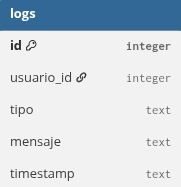

# Thouscif

Prototipo de vault de cifrado de archivos sensibles.

## 1. Objetivos

Thouscif es un prototipo de aplicación diseñada para proteger archivos mediante diversas capas de cifrado.

El objetivo de esta aplicación era poner en práctica los fundamentos teóricos adquiridos en código seguro, creando un prototipo funcional de una aplicación con diversas capas de seguridad.

El enfoque del proyecto era practicar conceptos de cifrado, gestión de contraseñas, arquitectura modular y diseño seguro de software.

## 2. Tecnologías

- **Lenguaje:** Python 3
- **Interfaz gráfica:** PySide6
- **Hash:** Argon2
- **Cifrado:** AES-GCM
- **Base de datos:** SQLite

## 3. Características principales
1. Registro y login con diversas capas de seguridad:
   - Validador de fortaleza de contraseñas.
   - Generador de contraseñas seguras.
   - Mecanismo de bloqueo por fuerza bruta.
   - Autenticación en dos factores (2FA).
2. Jerarquía de claves.
3. Historial de acciones persistente en base de datos.
4. Interfaz gráfica con PySide6.

## 4. Arquitectura general
### 4.1 Estructura por módulos
La aplicación está dividida en estos módulos:
- `main.py`: Punto de entrada.
- `GUI/`: Interfaz gráfica.
- `login/`: Lógica de autenticación.
- `vault_app/`: Lógica de la aplicación.

### 4.2 Descripción de componentes principales
#### 4.2.1 main.py
**Responsabilidad:**
- Punto de entrada.
- Importa la clase de Acceso desde el paquete GUI.
- Instancia Acceso() (que internamente crea la aplicación Qt, muestra la ventana y mantiene el loop).

**Flujo de interacción:**
1. `from GUI import Acceso`
2. `Acceso()`

#### 4.2.2 GUI/
**GUI.py:**
**Responsabilidad:**
- Motor principal de la interfaz.
- Crea la instancia de QApplication.
- Construye la ventana de autenticación (menú con pestañas Iniciar sesión, Registro y Salir).
- Gestiona los botones y campos de esa ventana.
- Invoca los controladores:
  1. `login.py` para verificar credenciales.
  2. `registro.py` para alta de nuevos usuarios.
- Si el login es correcto:
  1. Lanza `GUI_app.py` (dashboard principal).
  2. Pasa usuario autenticado.
- Muestra ventana Verificación 2FA antes de abrir el dashboard.

**Flujo de interacción:**
1. Arranque de la app, `GUI.py` crea `menu()`.
2. Usuario pulsa “Iniciar sesión”, `GUI.py` llama a `login.inicioDeSesion()`.
4. Si las credenciales son válidas, `GUI.py` abre `ventana_2fa()` y espera código.
5. Código correcto → cierra `ventana_2fa`, destruye `menu()` y abre `GUI_app.py()`.
6. Desde el Dashboard el usuario puede cifrar/descifrar archivos; `GUI_app` emite señales de progreso que `GUI.py` solo enruta (no procesa lógica de cifrado).

**GUI_app.py**
**Responsabilidad:**
- Ventana Dashboard principal tras la autenticación.
- Presenta botones/menús: Cifrar archivo, Descifrar archivo e Historial.
- Llama al módulo de cifrado:
  1. `cifrar_archivos(ruta)`
  2. `descifrar_archivo(ruta_encriptada)`
- Actualiza la base de datos (`db/database.py`) con metadatos del archivo cifrado/descifrado.
- Muestra barras de progreso y notificaciones (“archivo cifrado con éxito”, “clave incorrecta”, etc.).

**Flujo de interacción:**
1. Recibe usuario, contraseña y salt desde `GUI.py` al instanciarse.
2. Usuario pulsa Cifrar archivo → `QFileDialog` devuelve ruta, llama `vault_app.cifrar_archivos.Cifrador()`, guarda resultado en `/archivos/`, inserta registro en `db.archivos` y `db.historial_archivos`, muestra notificación.
3. Usuario pulsa Descifrar archivo, selecciona fichero, llama `vault_app.descifrar_archivos.Descifrador()`, escribe archivo temporal, muestra mensaje de éxito y la ruta de salida.

### 4.3 Diagrama de flujo general
Este es el diagrama del flujo principal de la aplicación:

### 4.4 Diagrama de flujo de autenticación
Este es el diagrama del flujo de autenticación de la aplicación:

### 4.5 Gestión de cifrado
La gestión de cifrado de esta aplicación se puede explicar en una jerarquía de claves. 

Este diagrama representa el funcionamiento de esta jerarquía:

## 5. Base de datos
### 5.1 Descripción general
La base de datos que utiliza la aplicación es una base SQLite local, creada para almacenar la información del usuario, contraseñas, claves cifradas y registros de uso. Se divide en varias tablas que representan las distintas funcionalidades críticas del sistema.

### 5.2 Diagrama de la base de datos

### 5.3 Tablas
A continuación se describen las tablas más relevantes:

**contraseñas:**
Contiene los datos necesarios del usuario registrado.

**archivos:**
Almacena la información de archivos cifrados por el usuario.

**logs:**
Registra acciones del usuario dentro del sistema.

### 5.4 Relaciones
Todas las tablas están relacionadas a la tabla de contraseñas, comparten el ID del usuario a través de una clave foránea.

## 6. Posibles mejoras y errores conocidos
### 6.1 Mejoras planificadas
- **Interfaz de usuario más pulida:**
Actualmente, la interfaz gráfica cumple su propósito pero presenta un diseño básico. Se planea integrar un estilo más moderno y responsivo con mejores alertas visuales y diseño adaptable.

- **Gestión centralizada de errores:**
Algunos errores no se reportan correctamente al usuario (por ejemplo, entradas inválidas que no muestran mensaje). Se mejorará la captura y visualización de excepciones mediante una capa dedicada a notificaciones.

- **Sistema de archivos temporales para descifrado:**
Actualmente los archivos se descifran en la ruta original. Se planea usar archivos temporales con eliminación automática tras su uso.

- **Control de sesiones y logout:**
Implementar cierre de sesión y posteriormente cierre de sesión automático tras inactividad y botón explícito de logout.

### 6.2 Errores conocidos

- **Alertas no visibles en ciertos errores:**
Al introducir datos incorrectos en algunos formularios, no aparece mensaje de error ni indicación visual.

- **Código difícil de escalar:**
Módulos como `GUI.py` concentran demasiada lógica. Esto complica el mantenimiento y la lectura, incluso por parte del autor.

- **Arquitectura de variables poco clara:**
El paso de variables entre clases y módulos no está completamente aislado, dificultando entender el flujo de datos sin revisar cada archivo.

- **Falta de modularidad en cifrado:**
Las funciones de cifrado/descifrado pueden refactorizarse para mejorar la reutilización y separar lógica de bajo nivel.

## 7. Conclusión
Soy consciente de que esta aplicación todavía se encuentra en una fase muy temprana y que tiene fallos tanto en su estructura como en su lógica interna. Aun así, este proyecto no nació con la intención de ser un producto finalizado, sino como una forma de aprender y aplicar conceptos reales sobre desarrollo seguro, cifrado y organización modular del código dentro del contexto de la ciberseguridad.

Ha sido un ejercicio muy valioso para comprender mejor cómo construir una aplicación desde cero, enfrentándome a problemas reales y tomando decisiones técnicas que me han hecho crecer. No considero que este sea un trabajo terminado, sino una base sobre la que seguiré construyendo y mejorando a medida que avance en mi formación.

## 8. Instalación de dependencias

Para ejecutar correctamente la aplicación, es necesario instalar las bibliotecas externas utilizadas. Todas están listadas en el archivo requirements.txt.

### Pasos para instalar:
1. Asegúrate de tener Python 3.10 o superior instalado.

2. Crea un entorno virtual:
   - python3 -m venv venv
   - source venv/bin/activate
    
3. Instala las dependencias necesarias con:
    - pip install -r requirements.txt

Una vez completado, la aplicación estará lista para ejecutarse desde main.py.

